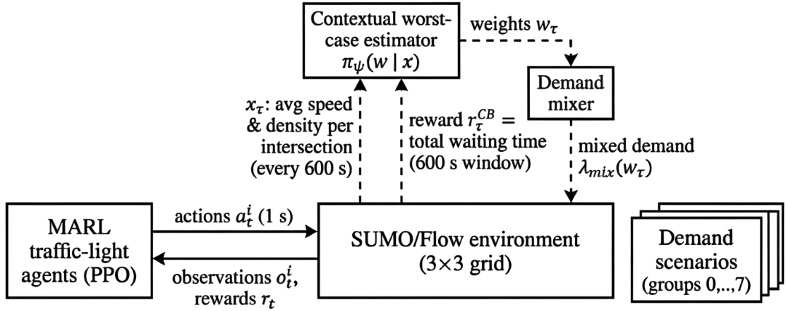
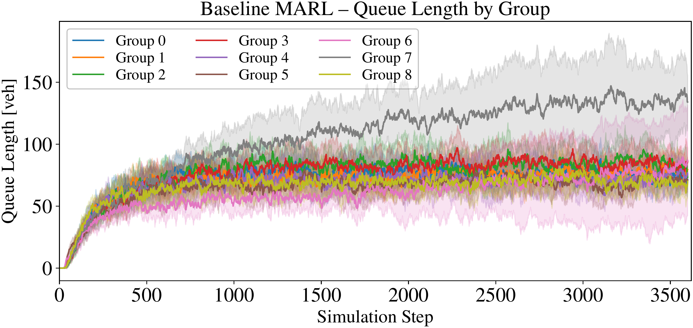
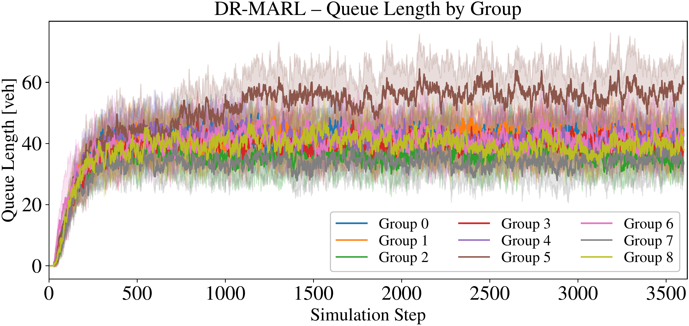
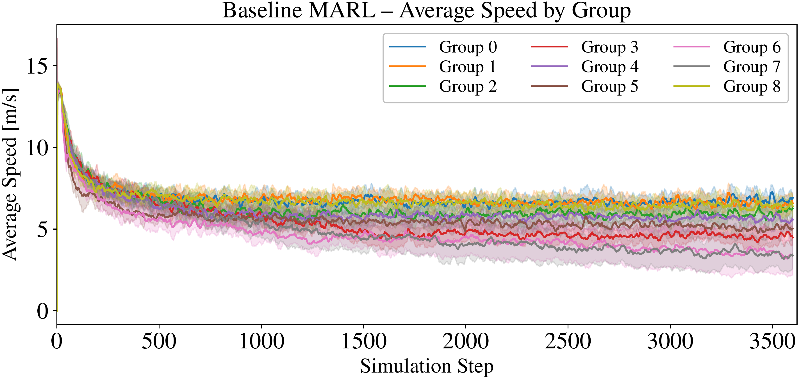
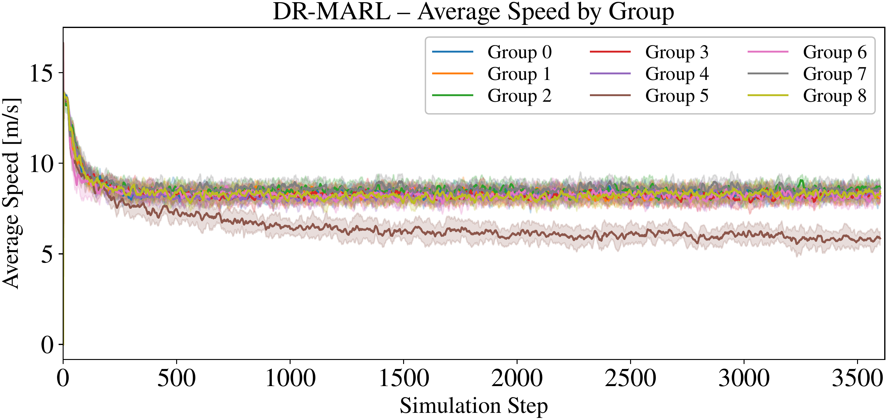
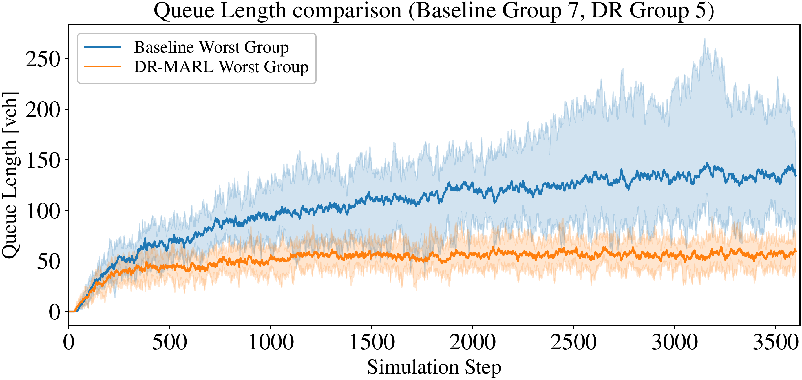
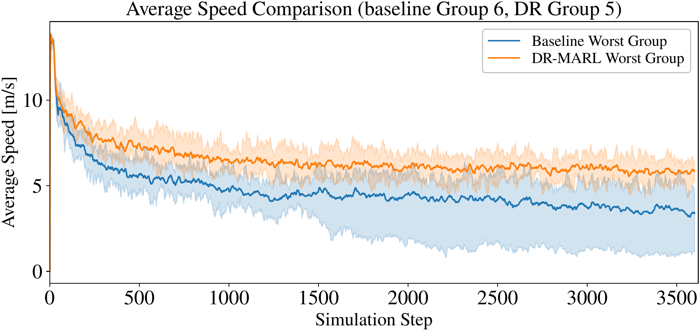

# Distributionally Robust Multi-Agent Reinforcement Learning for Intelligent Traffic Control

[](https://opensource.org/licenses/MIT)
[](https://flow-project.github.io/)

This repository contains the official implementation for the paper:  
**"Distributionally Robust Multi-Agent Reinforcement Learning for Intelligent Traffic Control"**  
*To be presented at the IFAC 2026 World Congress, Busan, South Korea.*

[**➡️ Read the Full Paper (PDF) 📄**](https://arxiv.org/pdf/2512.18558)

**Authors:** Shuwei Pei, Joran Borger, Arda Kosay, Muhammed O. Sayin, Saeed Ahmed.  
**Affiliations:** University of Groningen, the Netherlands & Bilkent University, Turkey.

---

## 📖 Abstract

Learning-based traffic signal control optimized for average performance often degrades under atypical conditions. To address this, we propose a distributionally robust multi-agent reinforcement learning (DR-MARL) framework, evaluated on a $3\times 3$ Athens grid calibrated with pNEUMA trajectory data. Our approach first trains a baseline MARL controller using proximal policy optimization. To capture demand uncertainty, we define eight heterogeneous origin-destination scenarios and train a contextual-bandit worst-case estimator to dynamically identify adversarial demand mixtures. Fine-tuning the baseline agents under these worst-case conditions yields our DR-MARL controller. Across all scenarios and an unseen Sioux Falls validation network, DR-MARL consistently improves upon the baseline, achieving up to 51% shorter queues and 38% higher speeds on the worst-performing scenarios.

---

## 💡 Framework Overview

The core of our work is a three-stage training pipeline designed to produce a robust traffic signal controller. The process begins with a standard MARL baseline, which is then challenged by an adversarial scenario generator (the CB-WCE). Finally, the baseline policy is fine-tuned under these challenging conditions to yield the final DR-MARL controller, which shows improved performance in both average and worst-case scenarios.



### Core Methodology:
1.  **Baseline MARL Controller**: We first instantiate a MARL controller for a signalized $3\times 3$ grid in a centralized training decentralized execution (CTDE) framework. This serves as our baseline and is trained on a static, spatially balanced demand pattern.
2.  **Contextual-Bandit Worst-Case Estimator (CB-WCE)**: We then train a dedicated estimator that learns to identify the most challenging mixtures of origin-destination (OD) traffic demands. This agent plays an adversarial role, trying to find scenarios that maximize network congestion for the fixed baseline controller.
3.  **Distributionally Robust Fine-tuning**: Finally, we retrain the baseline MARL controller with the frozen worst-case estimator. The estimator adaptively reweights traffic scenarios, forcing the MARL agents to learn a policy that is robust to a wide range of adversarial conditions.

---

## 📊 Key Results

Our DR-MARL controller demonstrates significant performance gains over the baseline MARL, especially under the most challenging traffic scenarios. It not only improves worst-case performance but also enhances average performance across all tested demand patterns, including an unseen Sioux Falls validation network.

**Highlights:**
- Up to a **51% reduction** in queue length in the worst-case scenario.
- Up to a **38% increase** in average speed in the worst-case scenario.
- Consistent improvements across all nine evaluation scenarios, including a 41.6% queue reduction and a 22.9% speed increase on the unseen Sioux Falls network.

The video below shows a side-by-side comparison of the baseline MARL controller and our robust DR-MARL controller.

<p align="center">
  <a href="https://youtu.be/B1vbEqz4a9Y">
    
  </a><br>
  <a href="https://youtu.be/B1vbEqz4a9Y"><b>📺 Watch the Full HD Video on YouTube</b></a>
</p>

### Performance Comparison

The plots below illustrate the consistent improvement of DR-MARL over the baseline across all nine demand scenarios.

#### **Network-Wide Queue Length**
DR-MARL consistently maintains lower queue lengths, preventing the severe congestion seen with the baseline controller under challenging demand groups (e.g., Group 7).

| Baseline MARL | DR-MARL (Robust) |
| :-----------: | :--------------: |
|  |  |

#### **Network-Wide Average Speed**
Average vehicle speeds are significantly higher and more stable with the DR-MARL controller, indicating smoother traffic flow.

| Baseline MARL | DR-MARL (Robust) |
| :-----------: | :--------------: |
|  |  |

#### **Worst-Case Performance Improvement**
DR-MARL significantly improves performance on the scenarios that were most challenging for the baseline model, demonstrating its enhanced robustness.

| Worst-Case Queue Length | Worst-Case Average Speed |
| :---------------------: | :----------------------: |
|  |  |

#### **Numerical Summary**
The table below summarizes these results numerically, reporting the horizon- and rollout-averaged metrics alongside their relative changes. DR-MARL substantially reduces queue lengths (by roughly 21–69%) and increases average speeds (by 16–77%) across all groups. Notably, the largest queue reduction (-68.7%) occurs in group 7, while the highest speed gains (+76.7%) are seen in groups 6 and 7. For the unseen Sioux Falls pattern (group 8), DR-MARL also reduces queues by 41.6% and increases speed by 22.9%, confirming strong generalization.

| Group | MARL Queue Length | DR-MARL Queue Length | Queue Change | MARL Average Speed | DR-MARL Average Speed | Speed Change |
| :---: | :---: | :---: | :---: | :---: | :---: | :---: |
| **0** | 72.287 | 40.137 | -44.5% | 6.882 | 8.411 | +22.2% |
| **1** | 70.318 | 39.959 | -43.2% | 6.925 | 8.404 | +21.3% |
| **2** | 76.829 | 35.250 | -54.1% | 6.297 | 8.571 | +36.1% |
| **3** | 76.062 | 38.528 | -49.3% | 5.429 | 8.358 | +54.0% |
| **4** | 67.008 | 40.250 | -39.9% | 6.105 | 8.347 | +36.7% |
| **5** | 64.620 | 51.302 | -20.6% | 5.647 | 6.524 | +15.5% |
| **6** | 60.094 | 39.914 | -33.6% | 4.714 | 8.330 | +76.7% |
| **7** | 105.153 | 32.932 | -68.7% | 4.910 | 8.685 | +76.7% |
| **8** | 65.711 | 38.372 | -41.6% | 6.795 | 8.353 | +22.9% |

---

## 🗂 Repository Structure

The project is built on the [Flow](https://github.com/flow-project/flow) framework, using **SUMO** for simulation and **Ray RLlib** for reinforcement learning.

```text
├── flow/                   # Core framework files (environments, networks, controllers)
│   ├── envs/multiagent/    # Custom traffic environments for DR-MARL and CB-WCE
│   └── networks/           # Network definitions (Athens Grid, Sioux Falls)
├── examples/               # Execution scripts
│   ├── train.py            # Main script for training RL policies
│   ├── eval_marl_vs_drmarl.py # Evaluation and comparison script
│   └── exp_configs/rl/multiagent/ # Configuration files for experiments
├── paper/                  # Contains the paper PDF, figures, and videos
├── eval_results/           # Generated metrics, CSVs, and performance plots
├── environment.yml         # Conda environment definition
└── requirements.txt        # Python dependencies
```

---

## ⚙️ Installation

### 1. Prerequisites
- **Python 3.7+**
- **SUMO**: Follow the [SUMO installation guide](https://sumo.dlr.de/docs/Installing.html). Ensure `SUMO_HOME` is set in your environment variables.

### 2. Setup Environment
We recommend using Conda:
```bash
# Create and activate the environment
conda env create -f environment.yml
conda activate flow

# Install additional dependencies
pip install -r requirements.txt
```

---

## 🚀 Usage Guide

### Phase 1: Train Baseline MARL
Train the initial traffic signal controller using standard demand distributions:
```bash
python examples/train.py --exp_config multiagent_traffic_light_grid
```

### Phase 2: Identify Worst-Case Scenarios (CB-WCE)
Train the Contextual-Bandit estimator to find adversarial demand mixtures:
```bash
python examples/train.py --exp_config worst_estimator_training
```

### Phase 3: Robust Fine-tuning (DR-MARL)
Fine-tune your baseline model using the worst-case distributions identified by the CB-WCE. Update your config to point to the saved baseline and estimator checkpoints, then run:
```bash
python examples/train.py --exp_config multiagent_traffic_light_grid_robust
```

### Phase 4: Evaluation
Compare the Baseline MARL and DR-MARL across different traffic demand groups:
```bash
python examples/eval_marl_vs_drmarl.py
```
Results (plots and raw CSVs) will be saved in the `eval_results/` directory.

---

## 📝 Citation

If you use this code or refer to our findings, please cite our work:

```bibtex
@inproceedings{pei2026drmarl,
  title={Distributionally Robust Multi-Agent Reinforcement Learning for Intelligent Traffic Control},
  author={Pei, Shuwei and Borger, Joran and Kosay, Arda and Sayin, Muhammed O. and Ahmed, Saeed},
  booktitle={IFAC World Congress},
  year={2026},
  address={Busan, South Korea}
}
```

---

## 📄 License
This project is licensed under the MIT License - see the [LICENSE.md](LICENSE.md) file for details.
