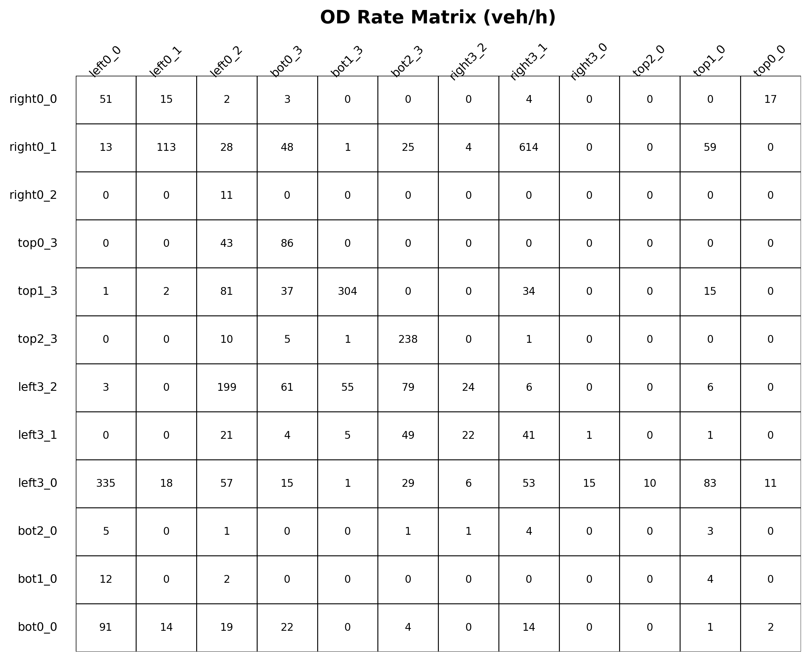
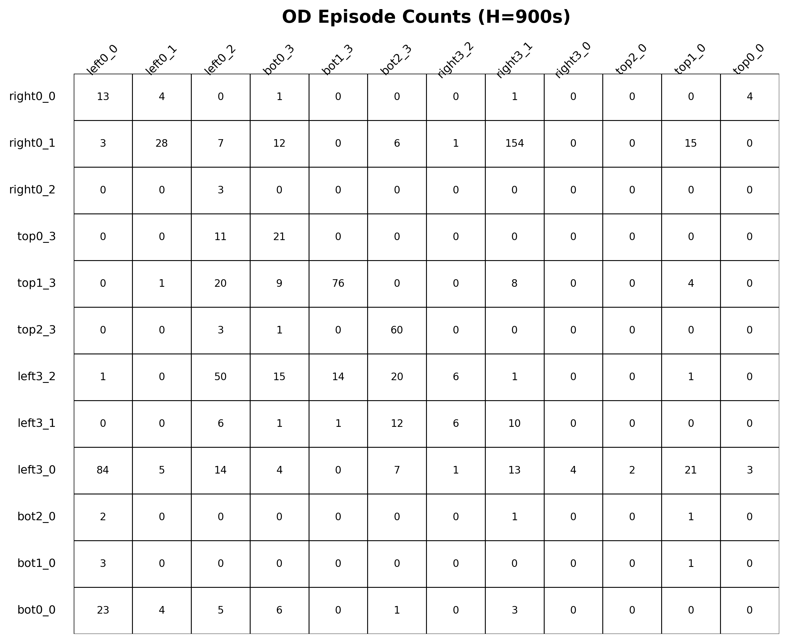
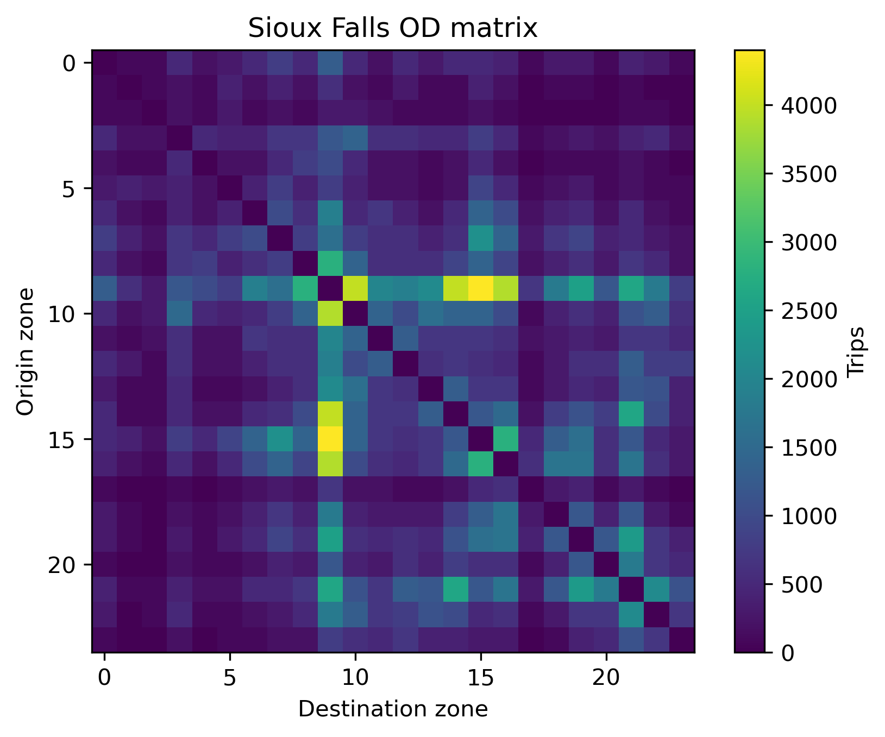
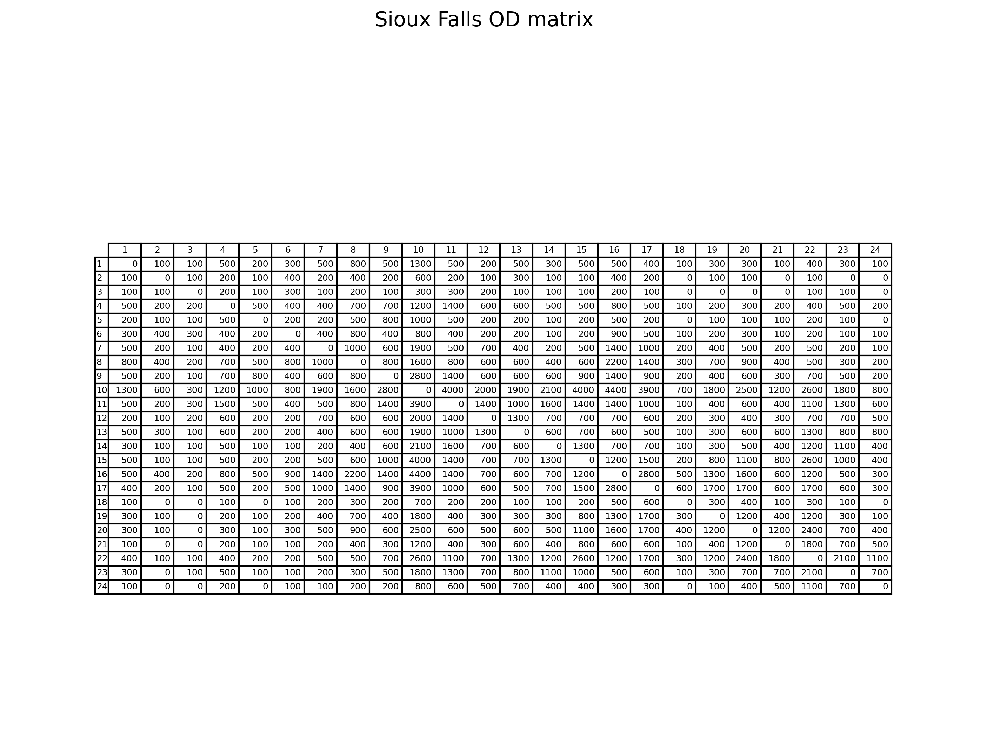

# Distributionally Robust Multi-Agent Reinforcement Learning for Intelligent Traffic Control

[](LICENSE.md)
[](https://flow-project.github.io/)
[](https://sumo.dlr.de/)
[](https://docs.ray.io/)

Official implementation of **"Distributionally Robust Multi-Agent Reinforcement Learning for Intelligent Traffic Control"**, to be presented at the **IFAC 2026 World Congress** in Busan, South Korea.

**Authors:** Shuwei Pei, Joran Borger, Arda Kosay, Muhammed O. Sayin, Saeed Ahmed<br>
**Affiliations:** University of Groningen, the Netherlands, and Bilkent University, Turkey<br>
**Paper:** [Read the arXiv PDF](https://arxiv.org/pdf/2512.18558)<br>
**Demo:** [Watch the controller comparison on YouTube](https://youtu.be/B1vbEqz4a9Y)

---

## Overview

Traffic signal controllers trained for average-case performance can degrade sharply under atypical demand. This repository implements a **distributionally robust multi-agent reinforcement learning (DR-MARL)** pipeline for network-level traffic signal control on a calibrated **3x3 Athens grid** using SUMO, Flow, and Ray RLlib.

The method first trains a shared-policy PPO MARL controller under a baseline traffic demand. It then trains a **contextual-bandit worst-case estimator (CB-WCE)** to identify difficult origin-destination demand mixtures. Finally, the traffic-light policy is fine-tuned against those adversarial mixtures, producing a controller that improves both average and worst-case behavior.

<table>
  <tr>
    <td width="50%" valign="top" align="center">
      <strong>DR-MARL training pipeline</strong><br>
      
    </td>
    <td width="50%" valign="top" align="center">
      <strong>Baseline vs. robust controller</strong><br>
      <a href="https://youtu.be/B1vbEqz4a9Y">
        
      </a>
    </td>
  </tr>
</table>

---

## Method At A Glance

| Stage | Component | Purpose |
| :-- | :-- | :-- |
| 1 | Baseline MARL | Train a parameter-shared PPO traffic-light controller on a calibrated 3x3 grid. |
| 2 | CB-WCE | Learn a contextual bandit that selects difficult OD-demand mixtures for the frozen baseline controller. |
| 3 | DR-MARL fine-tuning | Retrain the controller with the frozen CB-WCE so the policy adapts to worst-case demand shifts. |
| 4 | Evaluation | Compare baseline MARL and DR-MARL on nine fixed demand groups, including an unseen Sioux Falls pattern. |

Key implementation points:

- **Traffic simulator:** SUMO through the Flow framework.
- **RL backend:** Ray RLlib PPO.
- **Controller architecture:** shared traffic-light policy with decentralized execution.
- **Robustness mechanism:** frozen contextual-bandit demand scheduler during fine-tuning.
- **Metrics:** network-wide queue length and average speed.

---

## Key Results

DR-MARL consistently lowers queues and increases speeds across the evaluated demand groups. The largest gains occur on the most difficult scenarios for the baseline controller.

- Worst observed queue length is reduced by about **51.2%** when comparing the baseline worst case to the DR-MARL worst case.
- Worst observed average speed improves by about **38.4%**.
- On the unseen Sioux Falls demand pattern, DR-MARL reduces queues by **41.6%** and increases average speed by **22.9%**.

### Queue Length

<table>
  <tr>
    <td width="50%" valign="top" align="center">
      <strong>Baseline MARL</strong><br>
      
    </td>
    <td width="50%" valign="top" align="center">
      <strong>DR-MARL</strong><br>
      
    </td>
  </tr>
</table>

### Average Speed

<table>
  <tr>
    <td width="50%" valign="top" align="center">
      <strong>Baseline MARL</strong><br>
      
    </td>
    <td width="50%" valign="top" align="center">
      <strong>DR-MARL</strong><br>
      
    </td>
  </tr>
</table>

### Worst-Case Comparison

<table>
  <tr>
    <td width="50%" valign="top" align="center">
      <strong>Worst-case queue length</strong><br>
      
    </td>
    <td width="50%" valign="top" align="center">
      <strong>Worst-case average speed</strong><br>
      
    </td>
  </tr>
</table>

### Numerical Summary

The table reports horizon- and rollout-averaged queue length and average speed. Group 8 is the unseen Sioux Falls validation demand.

| Group | MARL Queue | DR-MARL Queue | Queue Change | MARL Speed | DR-MARL Speed | Speed Change |
| :--: | --: | --: | --: | --: | --: | --: |
| 0 | 72.287 | 40.137 | -44.5% | 6.882 | 8.411 | +22.2% |
| 1 | 70.318 | 39.959 | -43.2% | 6.925 | 8.404 | +21.3% |
| 2 | 76.829 | 35.250 | -54.1% | 6.297 | 8.571 | +36.1% |
| 3 | 76.062 | 38.528 | -49.3% | 5.429 | 8.358 | +54.0% |
| 4 | 67.008 | 40.250 | -39.9% | 6.105 | 8.347 | +36.7% |
| 5 | 64.620 | 51.302 | -20.6% | 5.647 | 6.524 | +15.5% |
| 6 | 60.094 | 39.914 | -33.6% | 4.714 | 8.330 | +76.7% |
| 7 | 105.153 | 32.932 | -68.7% | 4.910 | 8.685 | +76.7% |
| 8 | 65.711 | 38.372 | -41.6% | 6.795 | 8.353 | +22.9% |

<!-- ---

## Demand And Validation Assets

The repository also includes OD-demand and validation visualizations used during analysis.

<table>
  <tr>
    <td width="50%" valign="top" align="center">
      <strong>OD rates heatmap</strong><br>
      
    </td>
    <td width="50%" valign="top" align="center">
      <strong>OD episode counts</strong><br>
      
    </td>
  </tr>
  <tr>
    <td width="50%" valign="top" align="center">
      <strong>Sioux Falls OD matrix</strong><br>
      
    </td>
    <td width="50%" valign="top" align="center">
      <strong>Sioux Falls OD table</strong><br>
      
    </td>
  </tr>
</table>

--- -->

## Repository Structure

```text
.
|-- examples/
|   |-- train.py                          # Main RLlib training entry point
|   |-- eval_marl_vs_drmarl.py             # Baseline vs. DR-MARL evaluation script
|   `-- exp_configs/rl/multiagent/         # MARL, DR-MARL, WCE, and Sioux Falls configs
|-- flow/
|   |-- envs/WorstEstimatorTrafficEnv.py   # Contextual-bandit worst-case estimator environment
|   |-- envs/multiagent/                   # Traffic-light MARL and DR-MARL environments
|   |-- controllers/                       # Routing, OD, and traffic control helpers
|   `-- networks/                          # Athens grid and Sioux Falls network definitions
|-- flow/examples/
|   |-- Weights_to_csv_MARL.py             # Export baseline PPO weights
|   |-- Weights_to_csv_DRMARL.py           # Export DR-MARL PPO weights
|   `-- Weights_to_csv_WCE.py              # Export WCE weights
|-- paper/                                 # Paper figures, TeX source, and demo video
|-- eval_results*/                         # Stored evaluation outputs and plots
|-- environment.yml                        # Conda environment definition
|-- requirements.txt                       # Python package pins
`-- README.md
```

---

## Installation

### Prerequisites

- Python **3.7.3** is recommended because the project pins TensorFlow 1.15 and Ray 0.8.
- [SUMO](https://sumo.dlr.de/docs/Installing.html) with `SUMO_HOME` set.
- Conda or Miniconda.
- A Linux or WSL-style environment is recommended for full reproducibility with SUMO, Flow, Ray, and TensorFlow 1.x.

### Environment Setup

```bash
conda env create -f environment.yml
conda activate flow

pip install -r requirements.txt
pip install -e .
```

### Data Path Setup

Several experiment configs contain absolute local paths for OD CSV files and exported model weights, for example paths under `/home/sdc_joran/Athena_Data/...`. Before training or evaluating on a new machine, update these paths in:

- `examples/exp_configs/rl/multiagent/multiagent_traffic_light_grid.py`
- `examples/exp_configs/rl/multiagent/multiagent_traffic_light_grid_robust.py`
- `examples/exp_configs/rl/multiagent/worst_estimator_training.py`
- `flow/envs/WorstEstimatorTrafficEnv.py`
- `flow/envs/multiagent/traffic_light_grid_robust.py`

The repository already includes exported policy-weight CSV files that can be used by the evaluation scripts:

- `all_weights_in_one_file.csv`
- `dr_marl_all_weights.csv`
- `dr_marl_all_weights_3820.csv`
- `worst_case_estimator_weights_10.csv`
- `worst_case_estimator_weights_36.csv`

---

## Usage

Run commands from the repository root unless noted otherwise.

### 1. Train The Baseline MARL Controller

```bash
python examples/train.py multiagent_traffic_light_grid --rl_trainer rllib --num_steps 3454
```

The script writes Ray Tune checkpoints under `~/ray_results/` by default.

### 2. Export Baseline Weights

Update the checkpoint path inside `flow/examples/Weights_to_csv_MARL.py`, then run:

```bash
python flow/examples/Weights_to_csv_MARL.py
```

This exports the shared traffic-light policy to `all_weights_in_one_file.csv`.

### 3. Train The Worst-Case Estimator

Make sure the estimator config points to the exported baseline policy CSV, then run:

```bash
python examples/train.py worst_estimator_training --rl_trainer rllib --num_steps 50
```

After training, update the checkpoint path in `flow/examples/Weights_to_csv_WCE.py` and export:

```bash
python flow/examples/Weights_to_csv_WCE.py
```

### 4. Fine-Tune The DR-MARL Controller

Make sure the robust config points to the frozen WCE CSV and the local demand-group CSV files, then run:

```bash
python examples/train.py multiagent_traffic_light_grid_robust --rl_trainer rllib --num_steps 400 --checkpoint_path /path/to/baseline/checkpoint
```

After training, update the checkpoint path in `flow/examples/Weights_to_csv_DRMARL.py` and export:

```bash
python flow/examples/Weights_to_csv_DRMARL.py
```

### 5. Evaluate Baseline vs. DR-MARL

```bash
python examples/eval_marl_vs_drmarl.py \
  --baseline_csv all_weights_in_one_file.csv \
  --dr_csv dr_marl_all_weights.csv \
  --num_rollouts 10 \
  --horizon 3600 \
  --output_dir eval_results \
  --deterministic
```

The evaluation script saves raw per-rollout CSVs, summary averages, and plots in the chosen output directory.

Note: the committed evaluation script may be configured for a short smoke run. To reproduce the full nine-group table, set the group loop near the bottom of `examples/eval_marl_vs_drmarl.py` to evaluate `range(9)`.

---

## Reproducibility Notes

- `paper/` contains the publication figures used in this README.
- `eval_results_9_1/`, `eval_results_9_2/`, and `eval_results_9_3/` store repeated evaluation runs.
- `eval_results_Sioux_Falls_plots/` contains Sioux Falls validation plots.
- Some scripts intentionally use hard-coded checkpoint paths; update them before rerunning exports.
- The original Flow framework is included in this repository and extended with DR-MARL, CB-WCE, OD routing, and Sioux Falls validation components.

---

## Citation

If this repository helps your research, please cite:

```bibtex
@inproceedings{pei2026drmarl,
  title={Distributionally Robust Multi-Agent Reinforcement Learning for Intelligent Traffic Control},
  author={Pei, Shuwei and Borger, Joran and Kosay, Arda and Sayin, Muhammed O. and Ahmed, Saeed},
  booktitle={IFAC World Congress},
  year={2026},
  address={Busan, South Korea}
}
```

---

## License

This project is released under the MIT License. See [LICENSE.md](LICENSE.md) for details.
